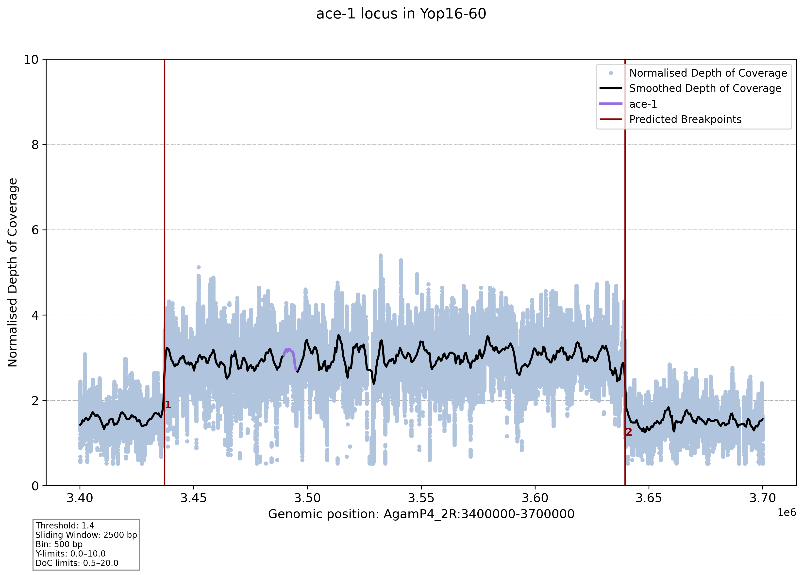

# Introducing Ar(chitecture of)Du(plications)
**Please bear with me as this readme -like ArDu- is still a Work In Progress**

ArDu is a tool designed to screen target loci for genomic duplications, provide estimates of their copy number, and identify their genetic architecture (i.e. breakpoints, copy numbers, secondary rearrangements). As it is entirely written in Python, it should be modular and easy enough to modify to accommodate the user's specific needs.

ArDu is now distributed as a proper Python package with four subcommands:

| Subcommand | Description |
|---|---|
| `ardu coverage` | Depth-of-coverage analysis, normalisation, copy number estimation, breakpoint detection |
| `ardu softclips` | Extract soft-clipped sequences around breakpoints, run BLAST |
| `ardu junctions` | Junction-read detection, bridging pairs, insert-size and softclip plots |
| `ardu parse` | Extract individual metric columns from a coverage TSV |

## Table of contents

- [Quick start](#quick-start)
- [Installation](#installation)
- [ardu coverage](#ardu-coverage)
- [ardu softclips](#ardu-softclips)
- [ardu junctions](#ardu-junctions)
- [ardu parse](#ardu-parse)
- [Output files](#output-files)
- [Milesi's lab addendum](#milesis-lab-addendum)
- [Debugging](#debugging)
- [Gene copy number estimates, word of caution and best practices](#gene-copy-number-estimates-word-of-caution-and-best-practises)
- [Reference](#reference)

## Quick start

### Minimal run:
```bash
ardu coverage -b bamlist.txt -r regions.txt -n Reference -o output_prefix
```

### With plotting and breakpoint detection:
```bash
ardu coverage -b bamlist.txt -r regions.txt -n Reference -o output_prefix \
  --plot png --plot-threshold 1.4 --breakpoint ruptures --bkp-model l2 --bkp-pen 10
```

### Full junction evidence pipeline:
```bash
ardu coverage -b bamlist.txt -r regions.bed -n reference -o run1 \
  --plot png --breakpoint ruptures

ardu junctions -b bamlist.txt -i ArDuRun-run1-DATE/run1_breakpoints.tsv \
  -s 30 -e 1000 --pairs 1-2 --spanning-reads \
  --blast reference.fa --plot-insert --plot-softclip \
  -o JunctionTest
```

## Installation

### From GitHub (recommended):
```bash
git clone https://github.com/ClaretJeanLoup/ArDu.git
cd ArDu/Development/ardu
pip install -e .
```

This installs all dependencies automatically and registers the `ardu` command.

### Dependencies
All dependencies are resolved automatically by pip:
`pysam`, `numpy`, `pandas`, `matplotlib`, `seaborn`, `ruptures`, `tqdm`, `pyahocorasick`, `scikit-learn`

### Verify installation:
```bash
ardu --help
```

---

## ardu coverage

Depth-of-coverage analysis across target loci, normalisation by a reference region, optional plotting and breakpoint detection.

### Example run — *Anopheles gambiae* ace-1 gene duplication:
```bash
ardu coverage -b bamlist.txt -n reference -r ace1.bed -o AgambR \
  --plot png --plot-interval ace1plot.bed --plot-slw 2500 --plot-bin 500 \
  --plot-target --plot-doclim 0.5 20 --plot-ylim 0 10 --plot-param \
  --breakpoint ruptures
```

#### Graphical output with putative breakpoints identified through *ruptures*
<p align="center">
  
</p>

### Arguments

| Argument | Description | Default |
|---|---|---|
| **Mandatory** | | |
| `-b, --bam` | File listing BAM paths, one per line. All BAMs must be indexed (`samtools index`). | |
| `-r, --region` | 4-column tab-delimited BED-like file: `chromosome start stop locus_name`. Regions sharing a name are pooled. | |
| `-n, --norm` | Name of the normalisation locus in the region file. | |
| `-o, --outfile` | Prefix for output file names. | |
| **Parallelism** | | |
| `-t, --threads` | Number of parallel BAM processing workers. | `1` |
| **Plotting** | | |
| `--plot` | Produce per-sample plots. Accepts: png, jpeg, jpg, pdf, svg, eps. | `None` |
| `--plot-threshold` | Minimum normalised coverage to trigger plotting. | `1.4` |
| `--plot-interval` | Tab-delimited file of custom plot intervals: `locus_name\tchrom:start-stop`. | `None` |
| `--plot-proportion` | Extend plot window to X times the locus span. | `2` |
| `--plot-auto` | Automatically expand the plot interval by probing coverage outward. | `False` |
| `--probe-size` | Probe window size (bp). | `500` |
| `--probe-threshold` | Coverage ratio threshold for probe evaluation. | `0.8` |
| `--probe-number` | Number of probes per extension round. | `20` |
| `--probe-spacing` | Distance between probe starts (bp). | `1000` |
| `--probe-drops` | Consecutive low-coverage probes required to stop extension. | `10` |
| `--max-extension` | Maximum extension on each side of the target (bp). | `5000000` |
| `--plot-slw` | Sliding window size (bp) for coverage smoothing. | `1000` |
| `--plot-ylim` | Y-axis limits: two numbers, e.g. `0 4`. | `None` |
| `--plot-doclim` | Min and max normalised DoC for plotting. Supports `min`/`max`. | `None` |
| `--plot-target` | Highlight the target region on the plot. | `False` |
| `--plot-force` | Force plotting regardless of coverage threshold. | `False` |
| `--plot-covar` | Overlay covariance and variance tracks. | `False` |
| `--plot-bin` | Genomic bin size (bp) applied on top of sliding window. | `None` |
| `--plot-dpi` | Plot resolution (DPI). | `300` |
| `--plot-param` | Print run parameters on the plot. | `False` |
| `--plot-pooled` | Produce an additional pooled plot per locus with one line per sample. Combined with `--breakpoint ruptures`, runs multivariate ruptures across all samples jointly. | `False` |
| `--plot-pooled-raw` | Show per-base normalised scatter on pooled plots. | `False` |
| **Probe profiling** | | |
| `--probe-profile` | Build per-sample probe profiles around each locus. Combined with `--plot-pooled`, groups samples by structural similarity before running pooled ruptures. | `False` |
| `--probe-cluster-dist` | Maximum Hamming distance for probe-profile clustering. Lower = stricter grouping. | `0.15` |
| `--probe-n-each-side` | Number of probes on each side of the target. | `20` |
| `--probe-profile-out` | Write `_probe_profiles.tsv` with per-sample profile strings. | `False` |
| **Breakpoint detection** | | |
| `-bkp, --breakpoint` | Breakpoint detection method: `ruptures` or `rollingaverage`. | `None` |
| `--bkp-slw` | Window size for rolling-average detection (bp). | `1000` |
| `--bkp-nb` | Expected number of breakpoints (ruptures). | `2` |
| `--bkp-pen` | Penalty for ruptures `predict()`. Higher = fewer breakpoints. | `None` |
| `--bkp-model` | ruptures cost model. | `l2` |
| `--bkp-algo` | ruptures algorithm. | `BottomUp` |
| `--bkp-threshold` | Shift threshold for rolling-average method. | `0.5` |
| `--bkp-passes` | Smoothing passes for rolling-average method. | `1` |
| **Genotyping** | | |
| `--mutation` | Tab-delimited file: `chromosome position [mutation_name]`. Returns per-nucleotide read counts at each position. | `None` |

---

## ardu softclips

Extracts soft-clipped sequences from BAM files around each breakpoint, writes them to FASTA, and optionally runs BLAST against a reference genome to identify cross-mapping between breakpoints.

```bash
ardu softclips -b bamlist.txt -i run1_breakpoints.tsv -o run1 \
  -s 30 -e 30 --blast reference.fa --plot
```

### Arguments

| Argument | Description | Default |
|---|---|---|
| `-b, --bam_list` | File listing BAM paths, one per line. | |
| `-i, --input` | Breakpoints TSV from `ardu coverage`. | |
| `-o, --output` | Output file prefix. | |
| `-s, --size` | Minimum soft-clip length to extract (bp). | `30` |
| `-e, --extension` | Region to search around each breakpoint (bp). | `30` |
| `--blast` | Reference genome FASTA; triggers BLAST run and hit filtering. | `None` |
| `--pairs` | Allowed breakpoint pairs, e.g. `--pairs 1-2 3-4`. | `None` |
| `--plot` | Plot softclip density per sample per breakpoint. | `False` |

---

## ardu junctions

Full junction-evidence pipeline. Uses the breakpoints TSV from `ardu coverage` to:
1. Extract soft-clipped sequences around each breakpoint
2. Detect bridging read pairs (mates mapping at different breakpoints)
3. Optionally find spanning reads — single reads whose sequence crosses the junction (using an Aho-Corasick automaton)
4. Optionally run BLAST on all extracted softclips
5. Produce insert-size and softclip pileup plots

All outputs are written to a `junctions/` subdirectory inside the existing `ArDuRun-*` output folder.

```bash
ardu junctions -b bamlist.txt -i ArDuRun-run1-DATE/run1_breakpoints.tsv \
  -s 30 -e 1000 --pairs 1-2 --spanning-reads \
  --blast reference.fa --plot-insert --plot-softclip \
  -o JunctionTest
```

### Arguments

| Argument | Description | Default |
|---|---|---|
| `-b, --bam_list` | File listing BAM paths, one per line. | |
| `-i, --input` | Breakpoints TSV from `ardu coverage`. | |
| `-o, --output` | Output prefix (written inside `junctions/` in the ArDuRun directory). | |
| `-s, --size` | Minimum soft-clip length to extract (bp). | `30` |
| `-e, --extension` | Region to search around each breakpoint (bp). | `30` |
| `--blast` | Reference genome FASTA; triggers BLAST and hit filtering. | `None` |
| `--pairs` | Restrict analysis to specific breakpoint pairs, e.g. `--pairs 1-2 3-4`. | `None` |
| `--spanning-reads` | Find reads whose sequence physically spans the breakpoint junction. | `False` |
| `--spanning-reads-fastq` | Write spanning reads as FASTQ instead of FASTA. | `False` |
| `--plot-insert` | Plot insert-size distributions. | `False` |
| `--plot-softclip` | Plot softclip pileup per breakpoint with mode and predicted position. | `False` |
| `--plot-mode` | `per-bam`, `pooled`, or `both`. | `per-bam` |

### Output files

| File | Description |
|---|---|
| `*_bridging_pairs.tsv` | Read pairs where one mate maps near each breakpoint. Contains BAM file, read name, positions, insert size, strand, and breakpoint bridge. |
| `*_soft_clipped_sequences.fasta` | All extracted soft-clipped sequences. |
| `*.tsv` | Per-read softclip details (position, CIGAR, mate position, insert size). |
| `*_BLAST_results.txt` | Raw BLAST output (if `--blast` used). |
| `*_BLAST_filtered_pairs.txt` | BLAST hits filtered to cross-breakpoint mappings. |
| `*_{sample}_1-2_junction_reads.fasta` | Reads spanning the junction (if `--spanning-reads` used). |
| `*_{sample}_insert_dist.png` | Insert-size distribution plots. |
| `*_{sample}_softclip_dist.png` | Softclip pileup plots with mode and predicted breakpoint positions. |

---

## ardu parse

Extracts individual metric columns from the semicolon-packed `coverage.tsv` into a flat, human-readable matrix.

```bash
ardu parse -i run1_coverage.tsv -o run1_rcn.tsv --RCN --medDOC
```

At least one field flag must be provided. Missing or malformed entries are converted to `NA`. Output is a wide-format matrix: first column is `locus`, each additional column is a `sample_field` combination.

| Argument | Description |
|---|---|
| `-i, --input` | Input ArDu coverage TSV. |
| `-o, --output` | Output TSV file. |
| `--uDOC` | Extract mean depth of coverage. |
| `--sdDOC` | Extract standard deviation. |
| `--medDOC` | Extract median depth of coverage. |
| `--CovBases` | Extract covered bases. |
| `--RCN` | Extract relative copy number. |

---

## Output files

### `ArDuRun-{prefix}-{date}/`

All outputs from `ardu coverage` are written to a timestamped run directory:

| File | Description |
|---|---|
| `*_coverage.tsv` | Per-locus coverage statistics, one semicolon-packed field per sample. Format: `uDoC;sdDoC;medDoC;CovBases;RCN`. |
| `*_breakpoints.tsv` | Predicted breakpoint positions (if `--breakpoint` used). Numbered in the same order as the plot. |
| `*_mutations.tsv` | Per-position nucleotide counts (if `--mutation` used). Format: `A=;T=;C=;G=;depth=`. |
| `{locus}-plots/` | Per-locus plot directory. Contains per-sample and pooled plots. |
| `junctions/` | All outputs from `ardu junctions` (created automatically). |

---

## Milesi's lab addendum
As of January 2026, a shared ArDu environment is available on the UPPMAX project. Make sure to add the following lines to your script:
```bash
ENV=/gorilla/proj/cnvrule/snic2020-6-185/software/envs/ardu_shared
export PATH=$ENV/bin:$PATH
export PYTHONNOUSERSITE=1

$ENV/bin/python $ENV/ArDu_1.0.py ...
```

*Now go out there and hunt some duplications!*

---

## Debugging

```
Error processing BAM file TestRun.bam: no index available for pileup
```
→ No index found. Check for `.bai` files and make sure their names match the BAM files.

```
Error processing BAM file TestRun.bam: invalid literal for int() with base 10: 'st'
```
→ Invalid line in the `-r` region file. Most likely a header that should be removed.

---

## Gene Copy Number Estimates, word of caution and best practises

ArDu uses depth of coverage from BAM alignment files to estimate copy number at target loci, normalised by a user-provided reference. Depending on the reference used, this normalised depth can be directly used as a copy number proxy (Claret et al. 2023).

The choice of reference is critical. A wide range of genomic intervals can be used, from whole chromosomes to a single gene, but we have seen consistent improvement in precision when using exonic sequences of a few housekeeping genes.

ArDu is specifically designed around a candidate locus approach. While it can handle large numbers of targets, it is not its intended use — expect long run times and reduced usability at genome-wide scale.

---

## Reference
If you use ArDu, please cite:
Claret Jean-Loup, Mestre Camille, Milesi Pascal and Labbé Pierrick, *in prep*.
**DOI:** [10.5281/zenodo.14922764](https://doi.org/10.5281/zenodo.14922764)
